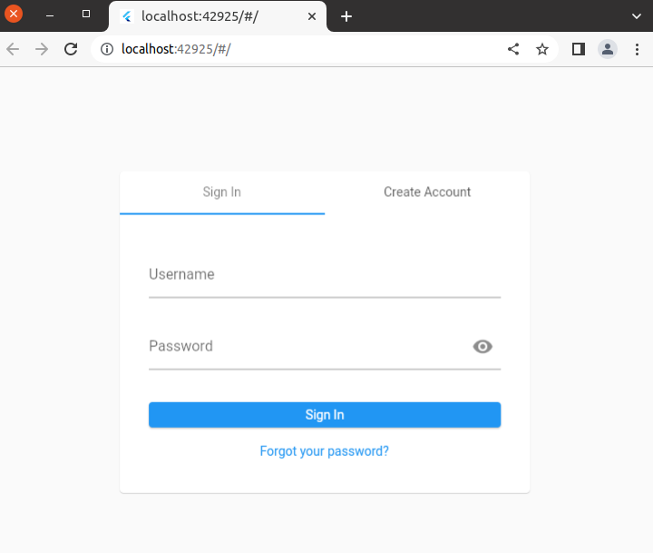
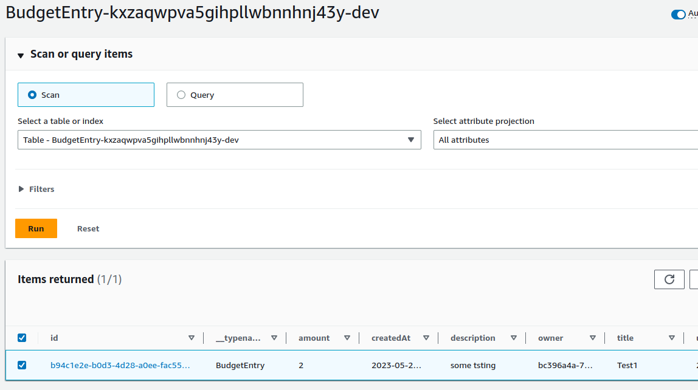

1. `mkdir infra`
2. `cd infra`
3. `cdk init --language=python`
4. `cd -`
5. `flutter create app`

Testing
1. `cd app`
2. `flutter run`
   1.  shows linux and chrome automatically detected options
   2.   Enable debug mode on phone (click build status 7 times + enable it). Plug in phone. `flutter run` automatically builds and opens app on phone.

1. Add amplify packages
   1. add to pubspec.yaml
   2. run `flutter pub get`
2. Update platform configurations
   1. android
3. `amplify init`
   1. Select CloudFormation
   2. Select profile with `AdministratorAccess-Amplify` policy permission
   3. If you can an error `You have reached the Amplify App limit for this account and region`. Delete all amplify apps and try again.
   4. Deploys a CloudFormation stack
      1.  2 IAM roles
      2.  S3 bucket
   5. Deploys an Amplify application
   6. Creates `amplify/` folder
      1. `team-provider-info.json` contains info about CloudFormation stacks and its resources
      2. a bunch of files/folders that should not be version controlled (see `.gitignore`)
   7. `amplify add api`
      1. select GraphQL
      2. Select AWS Incognito for authorisation
         1. Use default configuration
         2. Login with Username
      3. This updates `amplify/backend/backend-config.json` file with login configuration
      4. This creates `amplifybackend/auth/<app_name_suffix` folder with `cli-inputs.json` file which contains Congnito configuration.
      5. Enter `N` when prompted to Configure additional auth types
      6. Select Continue
      7. Add blank schema
      8. Select Y to edit schema
         ```
         type BudgetEntry @model @auth(rules: [{ allow: owner }]) {
         id: ID!
         title: String!
         description: String
         amount: Float!
         }
         ```
      9. `amplify push`
         1.  Updates existing stack with lambda function, role, and custom resource + 2 nested stacks
         2.  First nested stack: auth/cognito related resources
         3.  Second nested stack: AppSync GraphQL api, schema and Datasource + 2 more nested stacks
             1.  First nested stack: AppSync resolvers and function configurations
             2.  Second nested stack: empty
         4.  It returns your GraphQL endpoint and transform version
      10. `amplify codegen models` creates Dart model files based on GraphQL schema  
4.  Add `go_router` package
5.  run `flutter pub get` or VScode does this automatically on saving the `pubspec.yaml` file when Flutter extension is installed.
6.  Replace `main.dart` file with tutorial example
7.  Connect with Amplify auth and api backend services
    1.  Add `auth` (Cognitor) and `api` (GraphQL)
    2.  Replace some code in `main.dart` to configure amplify resources on start-up
8.  run `flutter run`
    1.  Login screen appears before app can be used
    2.  Creating real users with real emails/verification/password etc works out of the box due to Cognito!
        1. Create user `Jels` with fake email address
        2. Create second user `Jels` with real email address
        3. This fails because we choose that usernames have to be unique. The previous user is already stored in Cognito
        4. Manually delete fake user in Cognito
        5. Again create user `Jels` with real email address
        6. Out of the box, it sends verification email with code
        7. Enter received code
        8. You now enter the app's home screen
 9. Add new screen to enter budgets
    1.  Add new class
    2.  Add new route that instantiates this class screen
    3.  Go to this page when pressing `+` button
    4.  `flutter run`
    5.  Press `+` button after login
    6.  Enter budget details
        1.  title: `Test1`
        2.  description:  `some tst`
        3.  amount: `2`
    7.  Submit form
    8.  We are returned to home screen but don't see our newly created budget. It did, however, get created in DynamoDB
# Platform configuration updates
See docs for all platforms: https://docs.amplify.aws/start/getting-started/setup/q/integration/flutter/#platform-setup
## Android
Amplify requires a minimum of API level 24 (Android 7.0), Gradle 7 and Kotlin > 1.7 when targeting Android.

From your project root, navigate to the android/ directory and open build.gradle in the text editor of your choice. Update the Gradle plugin version to 7.4.2 or higher:
```
dependencies {
-       classpath 'com.android.tools.build:gradle:7.2.0'
+       classpath 'com.android.tools.build:gradle:7.4.2'
        classpath "org.jetbrains.kotlin:kotlin-gradle-plugin:$kotlin_version"
    }
``` 
If your Kotlin Gradle plugin version is below 1.7, update android/build.gradle:
```
ext.kotlin_version = '1.7.10'
```
Then, open android/gradle/wrapper/gradle-wrapper.properties. Update the Gradle distributionUrl to a version between 7.3 and 7.6.1 (see the Flutter docs for more info).
```
-distributionUrl=https\://services.gradle.org/distributions/gradle-7.0-all.zip
+distributionUrl=https\://services.gradle.org/distributions/gradle-7.6.1-all.zip
```
Then, open android/app/build.gradle. Update the minimum Android SDK version to 24 or higher:
```
defaultConfig {
        // TODO: Specify your own unique Application ID (https://developer.android.com/studio/build/application-id.html).
        applicationId "com.example.myapp"
        // You can update the following values to match your application needs.
        // For more information, see: https://docs.flutter.dev/deployment/android#reviewing-the-gradle-build-configuration.
-       minSdkVersion flutter.minSdkVersion
+       minSdkVersion 24
        targetSdkVersion flutter.targetSdkVersion
        versionCode flutterVersionCode.toInteger()
        versionName flutterVersionName
    }
```